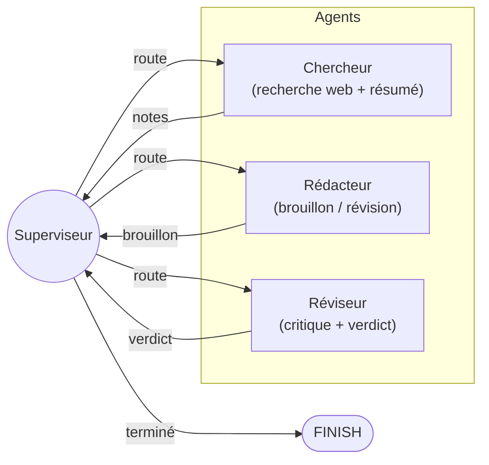

# Assistant de Recherche Multi-Agent

Un système multi-agent de qualité production construit avec [LangGraph](https://github.com/langchain-ai/langgraph) qui automatise la recherche, la rédaction et la révision éditoriale grâce à des agents IA coordonnés.

## Architecture



### Rôles des Agents

| Agent | Rôle | Outils |
|---|---|---|
| **Superviseur** | Inspecte l'état partagé et dirige le travail vers l'agent spécialiste approprié. Décide quand la tâche est terminée. | Aucun (routage basé sur LLM) |
| **Chercheur** | Collecte des informations sur le web en rapport avec la requête de l'utilisateur et les condense en notes structurées. | `web_search` (Tavily), `summarize` |
| **Rédacteur** | Transforme les notes de recherche en un rapport soigné et bien structuré. Intègre les retours du réviseur lors des révisions. | Génération LLM |
| **Réviseur** | Critique le brouillon pour son exactitude, sa clarté et son exhaustivité. Émet un verdict **ACCEPT** ou **REVISE**. | Évaluation LLM |

### Patterns Clés

- **Routage par superviseur** -- un nœud coordinateur central utilise des arêtes conditionnelles pour dispatcher le travail, évitant des pipelines rigides codés en dur.
- **Humain dans la boucle** -- le graphe peut être mis en pause avant le nœud réviseur grâce au mécanisme `interrupt_before` de LangGraph, permettant à un humain d'injecter des retours.
- **Utilisation d'outils** -- l'agent chercheur appelle des outils externes (`web_search`, `summarize`) pour collecter et condenser les informations.
- **LLM multi-fournisseurs** -- basculez entre OpenAI et Anthropic avec une seule variable d'environnement.
- **Raffinement itératif** -- la boucle rédacteur-réviseur s'exécute jusqu'à 3 cycles de révision, garantissant la qualité du résultat.

## Démarrage Rapide

```bash
# Cloner le dépôt
git clone https://github.com/<votre-username>/langgraph-multi-agent.git
cd langgraph-multi-agent

# Configurer l'environnement
cp .env-template .env
# Modifier .env avec vos clés API

# Installer les dépendances avec uv
uv sync

# Lancer une requête de recherche
uv run python main.py "Quelles sont les dernières avancées en informatique quantique ?"

# Mode verbeux (sortie complète des agents)
uv run python main.py --verbose "Expliquer l'état actuel de l'énergie de fusion nucléaire"
```

## Variables d'Environnement

| Variable | Obligatoire | Description |
|---|---|---|
| `OPENAI_API_KEY` | Oui (si `LLM_PROVIDER=openai`) | Clé API OpenAI |
| `ANTHROPIC_API_KEY` | Oui (si `LLM_PROVIDER=anthropic`) | Clé API Anthropic |
| `LLM_PROVIDER` | Non | `openai` (défaut) ou `anthropic` |
| `TAVILY_API_KEY` | Oui | Clé API [Tavily](https://tavily.com/) pour la recherche web |

## Exemple d'Utilisation

```bash
$ uv run python main.py "Comparer React et Svelte pour construire des applications web modernes"

============================================================
  Requête de recherche : Comparer React et Svelte pour construire des applications web modernes
============================================================

--- [SUPERVISEUR] ---
[Superviseur] Routage vers : chercheur

--- [CHERCHEUR] ---
[Chercheur] Notes collectées :
- React utilise un DOM virtuel ; Svelte compile en JS vanilla lors du build
- React a un écosystème et un marché de l'emploi plus larges
- Svelte offre des bundles plus légers et une syntaxe plus simple
...

--- [SUPERVISEUR] ---
[Superviseur] Routage vers : rédacteur

--- [RÉDACTEUR] ---
[Rédacteur] Brouillon produit (2847 caractères)

--- [SUPERVISEUR] ---
[Superviseur] Routage vers : réviseur

--- [RÉVISEUR] ---
[Réviseur] Verdict : ACCEPT
...

============================================================
  RAPPORT FINAL
============================================================

## React vs. Svelte : Une Analyse Comparative
...
```

## Docker

```bash
docker build -t assistant-recherche .
docker run --env-file .env assistant-recherche "Votre requête de recherche ici"
```

## Stack Technique

| Composant | Technologie |
|---|---|
| Orchestration | [LangGraph](https://github.com/langchain-ai/langgraph) |
| LLM (OpenAI) | GPT-4o via `langchain-openai` |
| LLM (Anthropic) | Claude Sonnet 4.5 via `langchain-anthropic` |
| Recherche Web | [Tavily](https://tavily.com/) via `langchain-community` |
| Configuration | `python-dotenv` + `pydantic` |
| Système de Build | [Hatch](https://hatch.pypa.io/) |
| Gestionnaire de Paquets | [uv](https://github.com/astral-sh/uv) |
| Conteneurisation | Docker (Python 3.12 slim) |

## Structure du Projet

```
langgraph-multi-agent/
├── agents/
│   ├── __init__.py
│   ├── config.py      # Configuration LLM multi-fournisseurs
│   ├── graph.py       # Définition du StateGraph LangGraph
│   └── tools.py       # Outils personnalisés (recherche web, résumé)
├── main.py            # Point d'entrée CLI
├── pyproject.toml     # Métadonnées et dépendances du projet
├── Dockerfile         # Build du conteneur
├── .env-template      # Modèle de variables d'environnement
└── .gitignore
```

## Mes Améliorations

- Étude de l'architecture multi-agent LangGraph
- Analyse du système de routage basé sur un superviseur
- Extension du projet avec des modules d'expérimentation personnalisés
- Meilleure compréhension des patterns d'orchestration LLM

