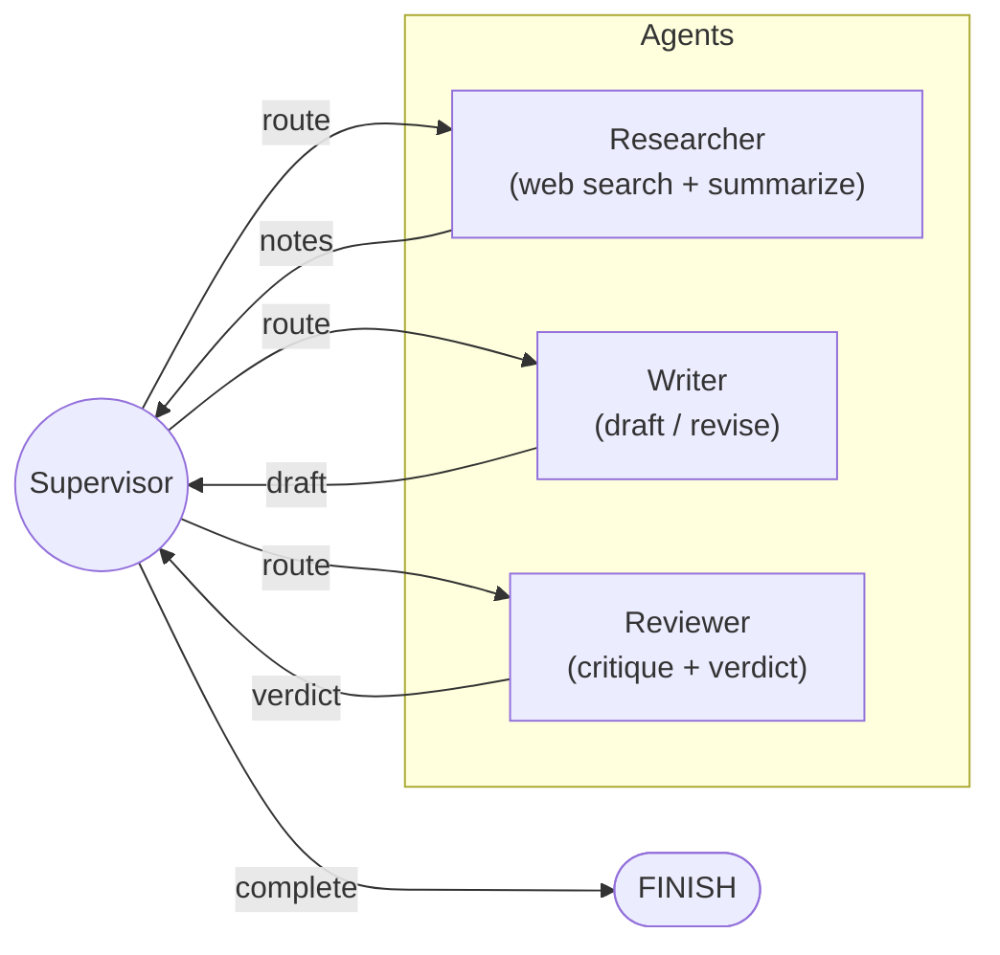

# Multi-Agent Research Assistant

A production-quality multi-agent system built with [LangGraph](https://github.com/langchain-ai/langgraph) that automates research, writing, and editorial review through coordinated AI agents.

## Architecture



### Agent Roles

| Agent | Role | Tools |
|---|---|---|
| **Supervisor** | Inspects shared state and routes work to the appropriate specialist agent. Decides when the task is complete. | None (LLM-based routing) |
| **Researcher** | Gathers information from the web relevant to the user's query and distils it into structured notes. | `web_search` (Tavily), `summarize` |
| **Writer** | Transforms research notes into a polished, well-structured report. Incorporates reviewer feedback on revisions. | LLM generation |
| **Reviewer** | Critiques the draft for accuracy, clarity, and completeness. Issues an **ACCEPT** or **REVISE** verdict. | LLM evaluation |

### Key Patterns

- **Supervisor routing** -- a central coordinator node uses conditional edges to dispatch work, avoiding brittle hard-coded pipelines.
- **Human-in-the-loop** -- the graph can be paused before the reviewer node using LangGraph's `interrupt_before` mechanism, allowing a human to inject feedback.
- **Tool use** -- the researcher agent calls external tools (`web_search`, `summarize`) to gather and condense information.
- **Multi-provider LLM** -- switch between OpenAI and Anthropic with a single environment variable.
- **Iterative refinement** -- the writer-reviewer loop runs up to 3 revision cycles, ensuring output quality.

## Quick Start

```bash
# Clone the repository
git clone https://github.com/<your-username>/langgraph-multi-agent.git
cd langgraph-multi-agent

# Set up environment
cp .env-template .env
# Edit .env with your API keys

# Install dependencies with uv
uv sync

# Run a research query
uv run python main.py "What are the latest breakthroughs in quantum computing?"

# Verbose mode (full agent output)
uv run python main.py --verbose "Explain the current state of nuclear fusion energy"
```

## Environment Variables

| Variable | Required | Description |
|---|---|---|
| `OPENAI_API_KEY` | Yes (if `LLM_PROVIDER=openai`) | OpenAI API key |
| `ANTHROPIC_API_KEY` | Yes (if `LLM_PROVIDER=anthropic`) | Anthropic API key |
| `LLM_PROVIDER` | No | `openai` (default) or `anthropic` |
| `TAVILY_API_KEY` | Yes | [Tavily](https://tavily.com/) API key for web search |

## Example Usage

```bash
$ uv run python main.py "Compare React and Svelte for building modern web apps"

============================================================
  Research query: Compare React and Svelte for building modern web apps
============================================================

--- [SUPERVISOR] ---
[Supervisor] Routing to: researcher

--- [RESEARCHER] ---
[Researcher] Gathered notes:
- React uses a virtual DOM; Svelte compiles to vanilla JS at build time
- React has a larger ecosystem and job market
- Svelte offers smaller bundle sizes and simpler syntax
...

--- [SUPERVISOR] ---
[Supervisor] Routing to: writer

--- [WRITER] ---
[Writer] Draft produced (2847 chars)

--- [SUPERVISOR] ---
[Supervisor] Routing to: reviewer

--- [REVIEWER] ---
[Reviewer] Verdict: ACCEPT
...

============================================================
  FINAL REPORT
============================================================

## React vs. Svelte: A Comparative Analysis
...
```

## Docker

```bash
docker build -t research-assistant .
docker run --env-file .env research-assistant "Your research query here"
```

## Tech Stack

| Component | Technology |
|---|---|
| Orchestration | [LangGraph](https://github.com/langchain-ai/langgraph) |
| LLM (OpenAI) | GPT-4o via `langchain-openai` |
| LLM (Anthropic) | Claude Sonnet 4.5 via `langchain-anthropic` |
| Web Search | [Tavily](https://tavily.com/) via `langchain-community` |
| Configuration | `python-dotenv` + `pydantic` |
| Build System | [Hatch](https://hatch.pypa.io/) |
| Package Manager | [uv](https://github.com/astral-sh/uv) |
| Containerisation | Docker (Python 3.12 slim) |

## Project Structure

```
langgraph-multi-agent/
├── agents/
│   ├── __init__.py
│   ├── config.py      # Multi-provider LLM configuration
│   ├── graph.py       # LangGraph StateGraph definition
│   └── tools.py       # Custom tools (web search, summarize)
├── main.py            # CLI entry point
├── pyproject.toml     # Project metadata and dependencies
├── Dockerfile         # Container build
├── .env-template      # Environment variable template
└── .gitignore
```


## My Improvements

- Studied multi-agent LangGraph architecture
- Analyzed supervisor-based routing system
- Extended project with custom experimentation modules
- Improved understanding of LLM orchestration patterns

## License

MIT
